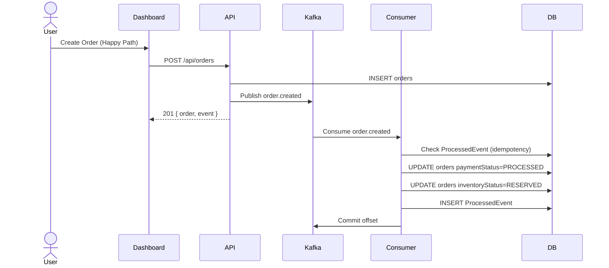
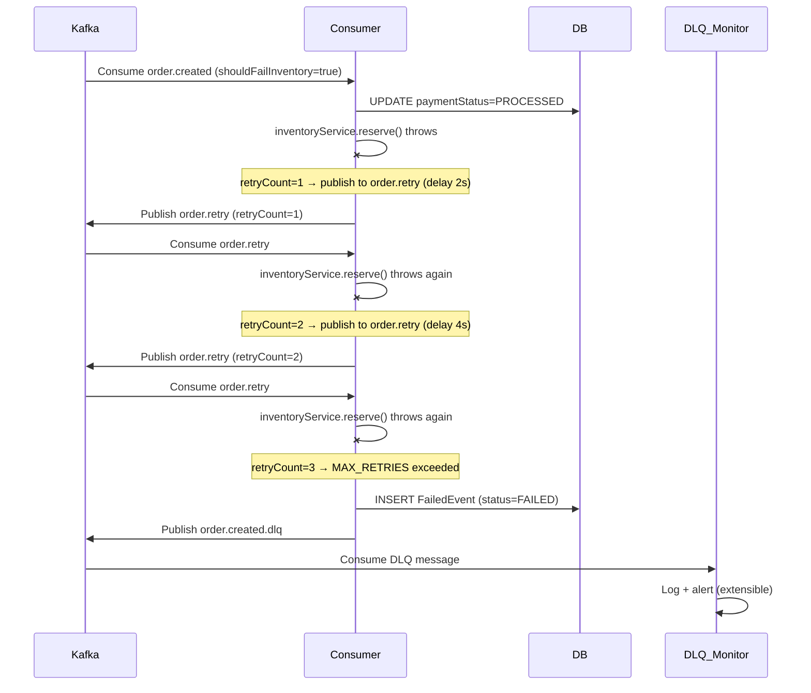
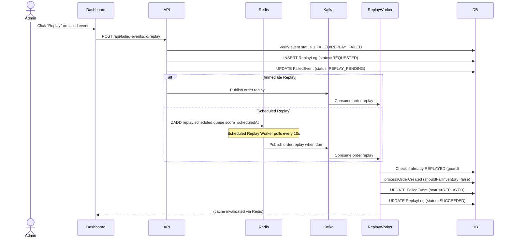
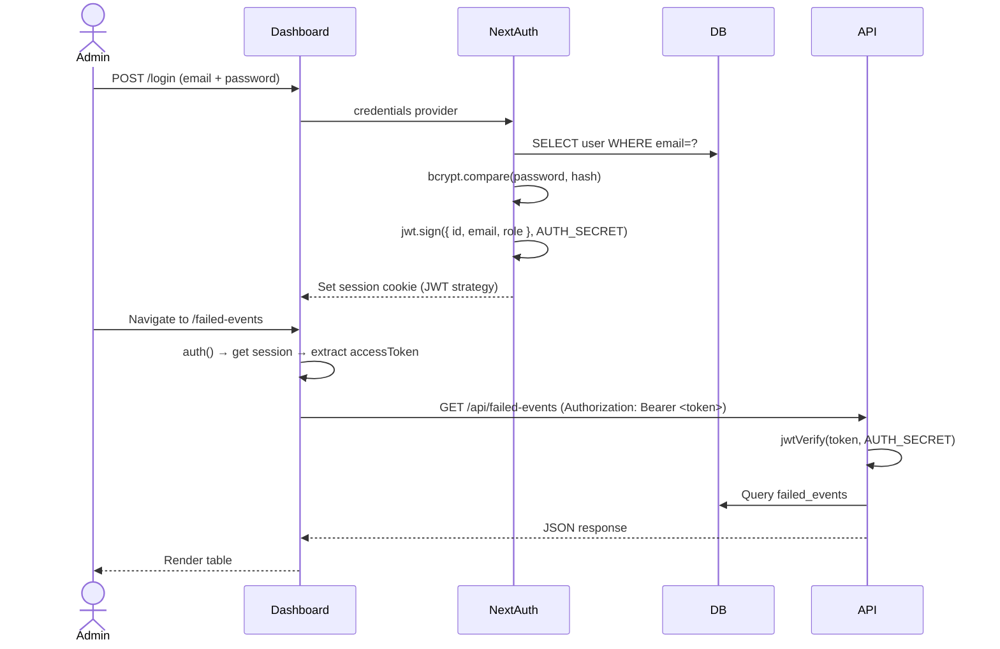

# Antigravity — Event Replay & Recovery System

A production-grade distributed event processing platform built to handle failures gracefully. When downstream services fail, events are captured, stored, and can be replayed manually or on a schedule — with full audit trails and a real-time dashboard.

> Built with **Next.js 16**, **Express**, **Kafka**, **Redis**, **PostgreSQL**, and **Prisma** in a TypeScript monorepo.

---

## Table of Contents

- [Architecture Overview](#architecture-overview)
- [Event Flow Diagrams](#event-flow-diagrams)
- [Services](#services)
- [Tech Stack](#tech-stack)
- [Data Models](#data-models)
- [Getting Started](#getting-started)
- [Environment Variables](#environment-variables)
- [API Reference](#api-reference)
- [Design Decisions](#design-decisions)
- [What I'd Do Differently](#what-id-do-differently)

---

## Architecture Overview

```
┌─────────────────────────────────────────────────────────────────────┐
│                        Client Browser                               │
└───────────────────────────┬─────────────────────────────────────────┘
                            │ HTTPS
                            ▼
┌─────────────────────────────────────────────────────────────────────┐
│                  Next.js Dashboard (Port 3000)                      │
│                                                                     │
│  ┌──────────────┐  ┌───────────────┐  ┌──────────────────────────┐ │
│  │  /overview   │  │ /failed-events│  │      /replay-logs        │ │
│  │  Stats Cards │  │ Filter + Table│  │   Audit Trail Table      │ │
│  │  Event Sim   │  │ Replay Button │  │                          │ │
│  └──────────────┘  └───────────────┘  └──────────────────────────┘ │
│                                                                     │
│  Server Actions (next-auth JWT → Bearer token forwarded to API)     │
└───────────────────────────┬─────────────────────────────────────────┘
                            │ HTTP + Bearer JWT
                            ▼
┌─────────────────────────────────────────────────────────────────────┐
│                   Express API Service (Port 8000)                   │
│                                                                     │
│   POST /api/orders          GET /api/failed-events                  │
│   GET  /api/metrics         POST /api/failed-events/:id/replay      │
│   GET  /api/replay-logs     GET  /api/health                        │
│                                                                     │
│   JWT verification (jose) → Controllers → Services → Repositories   │
└──────┬────────────────────────────────────┬──────────────────────────┘
       │ Publishes                          │ Reads/Writes
       ▼                                    ▼
┌─────────────┐                  ┌──────────────────────┐
│    Kafka    │                  │      PostgreSQL       │
│             │                  │                      │
│ order.      │                  │  orders              │
│ created     │                  │  failed_events       │
│             │                  │  processed_events    │
│ order.retry │                  │  replay_logs         │
│             │                  │  users               │
│ order.replay│                  │  accounts / sessions │
│             │                  └──────────────────────┘
│ order.      │
│ created.dlq │                  ┌──────────────────────┐
└──────┬───────┘                 │        Redis         │
       │                        │                      │
       │                        │  Cache (30s TTL)     │
       │                        │  failed-events:list  │
       │                        │  failed-events:detail│
       │                        │  failed-events:metrics│
       │                        │                      │
       │                        │  Scheduled Replays   │
       │                        │  replay:scheduled:   │
       │                        │  queue (sorted set)  │
       │                        └──────────────────────┘
       │
       ├──────────────────────────────────────────────────┐
       │                                                  │
       ▼                                                  ▼
┌──────────────────┐                          ┌───────────────────────┐
│ Consumer Worker  │                          │    Replay Worker      │
│                  │                          │                       │
│ Subscribes to:   │                          │ Subscribes to:        │
│ • order.created  │                          │ • order.replay        │
│ • order.retry    │                          │                       │
│                  │                          │ • Reprocesses events  │
│ On success →     │                          │ • Marks REPLAYED      │
│  ProcessedEvent  │                          │ • Updates ReplayLog   │
│                  │                          │ • Handles idempotency │
│ On failure →     │                          └───────────────────────┘
│  Retry (×3) →    │
│  FailedEvent +   │                          ┌───────────────────────┐
│  DLQ publish     │                          │  Scheduled Replay     │
└──────────────────┘                          │  Worker               │
                                              │                       │
┌──────────────────┐                          │ Polls Redis every 10s │
│   DLQ Monitor    │                          │ Publishes due items   │
│                  │                          │ to order.replay topic │
│ Subscribes to:   │                          └───────────────────────┘
│ • order.created  │
│   .dlq           │
│                  │
│ Logs + alerts    │
│ (extensible for  │
│  Slack/PagerDuty)│
└──────────────────┘
```

---

## Event Flow Diagrams

### Happy Path — Order Processing



---

### Failure Path — Retry → DLQ → FailedEvent



---

### Replay Path — Manual & Scheduled



---

### Auth Flow



---

## Services

| Service | Port | Description |
|---|---|---|
| `apps/dashboard` | 3000 | Next.js 16 admin dashboard with SSR, next-auth, server actions |
| `services/api` | 8000 | Express REST API, JWT-authenticated, Redis-cached |
| `services/consumer-worker` | — | Kafka consumer for `order.created` + `order.retry` |
| `services/replay-worker` | — | Kafka consumer for `order.replay`, handles idempotent reprocessing |
| `services/dlq-monitor` | — | Kafka consumer for `order.created.dlq`, logging + alerting hook |
| `services/scheduled-replay-worker` | — | Polls Redis sorted set every 10s, dispatches due scheduled replays |
| `packages/shared` | — | Shared library: Prisma, Kafka, Redis, repositories, services |

---

## Tech Stack

| Layer | Technology | Why |
|---|---|---|
| **Frontend** | Next.js 16 (App Router) | SSR for auth, server actions keep tokens off the client |
| **API** | Express 5 + TypeScript | Lightweight, familiar, easy to reason about |
| **Message Broker** | Apache Kafka (KRaft mode) | Durable, ordered, replayable event log |
| **Cache** | Redis | Sub-millisecond cache + sorted set for scheduled replays |
| **Database** | PostgreSQL + Prisma | ACID transactions, strong typing, migration history |
| **Auth** | next-auth v5 (beta) + JWT | Session in cookie, API uses signed JWT bearer token |
| **Containerisation** | Docker + Docker Compose | One-command local setup |
| **Monorepo** | npm workspaces + Turborepo | Shared code without publishing packages |
| **Language** | TypeScript (strict) | End-to-end type safety across all services |

---

## Data Models

```
┌─────────────────────────────────────────────────────────┐
│  FailedEvent                                            │
│                                                         │
│  id               String  PK                           │
│  eventId          String  UNIQUE  (Kafka message key)  │
│  eventType        String                               │
│  tenantId         String                               │
│  streamName       String  (source Kafka topic)         │
│  orderId          String?                              │
│  originalPayload  Json    (full event snapshot)        │
│  errorMessage     String                               │
│  retryCount       Int                                  │
│  status           FAILED | REPLAY_PENDING |            │
│                   REPLAYED | REPLAY_FAILED             │
│  firstFailedAt    DateTime                             │
│  lastFailedAt     DateTime                             │
│  replayedAt       DateTime?                            │
│  replayRequestedBy String?                             │
│  replayMetadata   Json?                               │
│                                ▼                       │
│                         ReplayLog[]                    │
└─────────────────────────────────────────────────────────┘

┌─────────────────────────────────────────────────────────┐
│  ReplayLog                                              │
│                                                         │
│  id             String  PK                             │
│  failedEventId  String  FK → FailedEvent               │
│  eventId        String                                 │
│  userId         String  FK → User                      │
│  status         REQUESTED | SUCCEEDED |                │
│                 FAILED | SKIPPED_ALREADY_PROCESSED     │
│  requestPayload Json?   (scheduledAt, requestedBy)     │
│  resultPayload  Json?   (skipped, reason)              │
│  errorMessage   String?                                │
└─────────────────────────────────────────────────────────┘

┌─────────────────────────────────────────────────────────┐
│  ProcessedEvent                                         │
│                                                         │
│  id           String  PK                               │
│  eventId      String  UNIQUE  ← idempotency key        │
│  eventType    String                                   │
│  tenantId     String                                   │
│  orderId      String?                                  │
│  sourceStream String                                   │
│  replayed     Boolean                                  │
│  processor    String  (consumer-worker | replay-worker)│
│  checksum     String? (SHA-256 of full event)          │
└─────────────────────────────────────────────────────────┘
```

**State Machine — FailedEvent.status**

```
                    ┌─────────────────────────────────┐
                    │                                 │
              Consumer fails after              Replay fails
              MAX_RETRIES (3)                        │
                    │                                 │
                    ▼                                 │
              ┌──────────┐   Admin clicks    ┌────────────────┐
              │  FAILED  │──── Replay ──────▶│ REPLAY_PENDING │
              └──────────┘                  └────────────────┘
                    ▲                                 │
                    │                          Worker picks up
              REPLAY_FAILED ◀────────────            │
              (status revert)   replay       ┌───────┴────────┐
                    │           fails        │                │
                    │                  succeeds           fails
                    │                        │                │
                    │                        ▼                ▼
                    │                  ┌──────────┐   ┌──────────────┐
                    └──────────────────│ REPLAYED │   │ REPLAY_FAILED│
                                       └──────────┘   └──────────────┘
                                                             │
                                                      Admin can retry
                                                      replay again
```

---

## Getting Started

### Prerequisites

- Docker + Docker Compose
- Node.js 20+
- npm 10+

### 1. Clone and install

```bash
git clone <your-repo-url>
cd event-replay-recovery-system
npm install
```

### 2. Configure environment

```bash
cp .env.example .env
# Edit .env — minimum required: POSTGRES_USER, POSTGRES_PASSWORD, POSTGRES_DB
```

### 3. Start all services

```bash
docker compose up -d
```

This starts PostgreSQL, Redis, Kafka, the API, all workers, and the dashboard.

### 4. Run database migrations and seed

```bash
# Migrations run automatically on API startup via prisma migrate deploy
# Seed an admin user
docker compose exec api npx prisma db seed
# Or manually via: npm run db:seed
```

### 5. Open the dashboard

```
http://localhost:3000
```

Default credentials (from seed):
- **Email:** `nayakraja@gmail.com`
- **Password:** `password123`

> ⚠️ Change your password after first login.

### 6. Simulate a failure

In the dashboard → **Event Simulation Console**:
- Set **Resiliency Mode** to `Fail Inventory`
- Click **Dispatch Event**
- Watch the failed event appear in the table within seconds
- Click **Replay** to recover it

---

## Environment Variables

| Variable | Required | Default | Description |
|---|---|---|---|
| `DATABASE_URL` | ✅ | — | PostgreSQL connection string |
| `REDIS_URL` | ✅ | — | Redis connection string |
| `KAFKA_BROKERS` | ✅ | `kafka:9092` | Comma-separated broker list |
| `AUTH_SECRET` | ✅ | — | JWT signing secret (min 32 chars) |
| `POSTGRES_USER` | ✅ | — | DB username (used by docker-compose) |
| `POSTGRES_PASSWORD` | ✅ | — | DB password |
| `POSTGRES_DB` | ✅ | — | Database name |
| `MAX_RETRIES` | ❌ | `3` | Max consumer retries before DLQ |
| `RETRY_BACKOFF_MS` | ❌ | `2000` | Base backoff delay in ms |
| `LOG_LEVEL` | ❌ | `info` | Pino log level |
| `KAFKA_CLIENT_ID` | ❌ | `event-replay-platform` | Kafka client identifier |
| `TOPIC_ORDER_CREATED` | ❌ | `order.created` | Main event topic |
| `TOPIC_ORDER_RETRY` | ❌ | `order.created.retry` | Retry topic |
| `TOPIC_ORDER_REPLAY` | ❌ | `order.replay` | Replay dispatch topic |
| `TOPIC_ORDER_DLQ` | ❌ | `order.created.dlq` | Dead letter queue topic |

Generate a safe `AUTH_SECRET`:
```bash
openssl rand -base64 32
```

---

## API Reference

All endpoints (except `/api/health` and `/api/orders`) require:
```
Authorization: Bearer <jwt>
```

### Orders

```
POST /api/orders
Content-Type: application/json

{
  "tenantId": "tenant-demo",
  "amount": 1499,
  "currency": "INR",
  "shouldFailInventory": true,     // triggers failure for demo
  "idempotencyKey": "optional-key" // prevents duplicate orders
}
```

### Failed Events

```
GET  /api/failed-events?status=FAILED&search=ORD-123
GET  /api/failed-events/:id
POST /api/failed-events/:id/replay

// Replay body (optional)
{
  "scheduledAt": "2025-06-01T10:00:00.000Z"  // omit for immediate
}
```

### Replay Logs

```
GET /api/replay-logs?status=SUCCEEDED
```

### Metrics

```
GET /api/metrics
→ { "failedEventsByStatus": [{ "status": "FAILED", "_count": 12 }, ...] }
```

---

## Design Decisions

**Why Kafka over a simple database queue?**
Kafka gives durable, replayable, ordered event logs across consumer groups. Multiple services (consumer-worker, dlq-monitor) can consume the same events independently without coordination.

**Why store `originalPayload` as JSON in FailedEvent?**
The event schema may evolve. Storing the full snapshot means replay always uses the exact original payload, not a reconstructed one. The replay worker then overrides only `shouldFailInventory=false`.

**Why Redis sorted set for scheduled replays?**
`ZADD key score member` with `ZRANGEBYSCORE key 0 now` gives O(log N) inserts and O(log N + M) range reads. It's atomic and survives restarts — unlike `setTimeout` which is lost on process death.

**Why JWT bearer token forwarded from Next.js to API?**
next-auth signs a custom JWT with `AUTH_SECRET` and embeds it in the session. Server actions extract it and forward it as a Bearer token. This means sensitive tokens never reach the browser — only the session cookie does.

**Why idempotency via `ProcessedEvent` unique constraint?**
Consumer failures can cause redelivery. Using a unique index on `eventId` and catching `P2002` (Prisma unique violation) ensures exactly-once processing semantics without distributed locks.

**Why separate `consumer-worker` and `replay-worker`?**
Different consumer groups, different SLAs. Replay events need careful logging and status updates that would add noise to the main consumer. Separation also allows independent scaling.

---

## What I'd Do Differently

**Structured logging with trace IDs**
Generate a `traceId` at order creation, embed it in Kafka headers, and include it in every log line across all services. This makes debugging across 5 services tractable.

**Testcontainers integration tests**
Spin up real Postgres + Redis + Kafka in CI and test the full pipeline: order created → consumer failure → DLQ → replay → REPLAYED status. This is the most valuable test you can write for a system like this.

**Replace `setTimeout` retry with Redis delayed queue**
Use `ZADD` with a future timestamp, same pattern as scheduled replays. This makes retries durable across process restarts.

**Prometheus metrics + Grafana dashboard**
Expose `/metrics` in Prometheus text format covering queue depths, replay success rates, and consumer lag. Attach a Grafana dashboard. This makes the system observable without logging into the app.

**Webhook outbound notifications**
After a successful replay, `POST` to the tenant's registered webhook URL with the result. This closes the loop for tenants who need to know their event was recovered.

**Event schema registry**
Validate incoming Kafka messages against a Zod schema before processing. Malformed events should fail immediately with a schema validation error rather than a cryptic downstream failure.

---

## Project Structure

```
.
├── apps/
│   └── dashboard/          # Next.js 16 frontend
│       ├── src/
│       │   ├── app/        # App router pages + API routes
│       │   ├── components/ # UI components
│       │   └── lib/        # auth, api client, utils
│       └── Dockerfile
│
├── services/
│   ├── api/                # Express REST API
│   ├── consumer-worker/    # Kafka consumer (main + retry topics)
│   ├── replay-worker/      # Kafka consumer (replay topic)
│   ├── dlq-monitor/        # Kafka consumer (DLQ topic)
│   └── scheduled-replay-worker/  # Redis polling worker
│
├── packages/
│   └── shared/             # Shared library
│       └── src/
│           ├── cache/      # Redis cache service + keys
│           ├── config/     # Environment validation (Zod)
│           ├── db/         # Prisma client singleton
│           ├── events/     # Event types, factory, bus
│           ├── kafka/      # Client, producer, admin, topics
│           ├── logging/    # Pino logger
│           ├── redis/      # Redis client
│           ├── repositories/ # Data access layer
│           ├── services/   # Business logic
│           └── utils/      # IDs, JSON, sleep
│
├── prisma/
│   ├── schema.prisma       # Database schema
│   ├── migrations/         # Migration history
│   └── seed.ts             # Admin user seed
│
├── docker-compose.yml      # Full local stack
└── turbo.json              # Turborepo pipeline
```

---

## CI/CD

GitHub Actions workflow (`.github/workflows/deploy.yml`) on push to `main`:

1. Build and push Docker images for `api` and `dashboard` to Docker Hub
2. SSH into AWS instance
3. `docker compose pull && docker compose up -d`
4. Prune old images

---

*Built by Raja Nayak*
